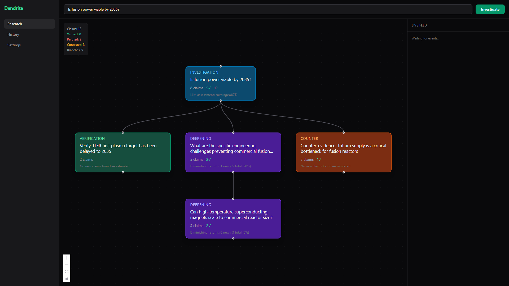
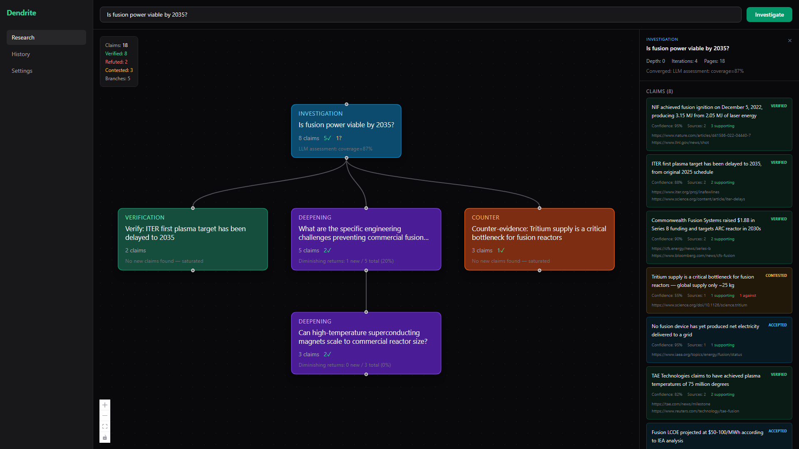
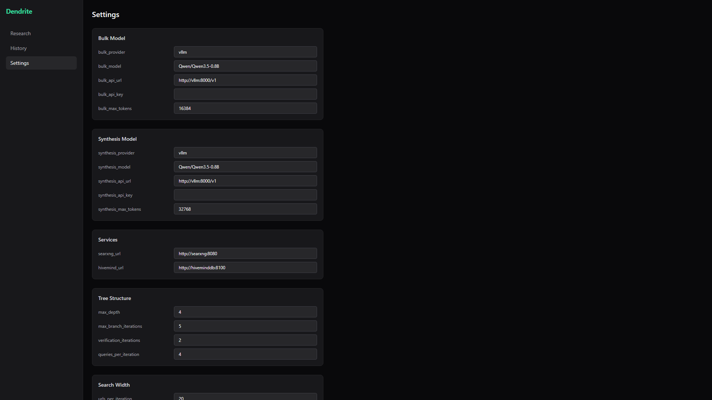

# Dendrite

Recursive branching truth engine. Builds research **trees**, not flat lists — each claim gets independently verified, each sub-topic gets its own branch, contradictions get investigated from both sides. The tree grows until convergence.



## How It Works

Each iteration: generate queries → search all providers → fetch → extract claims → triage (ACCEPT/VERIFY/DEEPEN/COUNTER) → check convergence → recurse into child branches. After all branches converge: cross-validate pending claims, synthesize final report.

| | |
|---|---|
|  |  |

## Architecture

Four Docker containers on a bridge network:

| Service | Port | Purpose |
|---------|------|---------|
| **orchestrator** | 8082 | FastAPI backend + React frontend + MCP server |
| **vllm** | 8000 | Local LLM inference (CUDA) |
| **searxng** | 8888 | Metasearch engine proxy |
| **hiveminddb** | 8100 | Knowledge graph + vector DB |

**Two-model architecture:**
- **Bulk model** (small/fast) — claim extraction, query generation, triage
- **Synthesis model** (larger) — cross-validation, final report

## Quick Start

```bash
# Clone with submodule
git clone --recurse-submodules https://github.com/NodeNestor/Dendrite.git
cd Dendrite

# Configure (copy and edit)
cp .env.example .env  # Set GPU_DEVICE, models, etc.

# Start everything
docker compose up -d

# Open web UI
open http://localhost:8082

# Or use the API
curl -X POST http://localhost:8082/api/research \
  -H "Content-Type: application/json" \
  -d '{"question": "Is fusion power viable by 2035?"}'
```

## Configuration

All research parameters are configurable via `.env`, the API (`PUT /api/config`), or the web UI:

| Group | Parameters |
|-------|-----------|
| **Tree Structure** | `max_depth`, `max_branch_iterations`, `verification_iterations`, `queries_per_iteration` |
| **Search Width** | `urls_per_iteration`, `results_per_provider`, `max_concurrent_fetches`, `max_concurrent_llm` |
| **Verification** | `verification_threshold`, `min_independent_sources`, `max_concurrent_verifications`, `verification_fetch_count` |
| **Convergence** | `min_convergence_iterations`, `diminishing_returns_threshold`, `coverage_target` |

## MCP Integration

Dendrite exposes 7 MCP tools for use with Claude Code or any MCP client:

| Tool | Purpose |
|------|---------|
| `investigate` | Start a full research tree |
| `investigate_status` | Check progress of running investigation |
| `investigate_result` | Get final results + synthesis |
| `verify_claim` | Cross-validate a single claim |
| `search_knowledge` | Search past trees + HiveMindDB |
| `add_provider` | Register a custom data provider |
| `configure` | Update models, concurrency, depth limits |

```bash
# Run in MCP mode (stdio)
python -m orchestrator.src.main mcp
```

## Key Concepts

- **Branch types**: investigation (main), verification (independent check), deepening (sub-question), counter (opposing evidence)
- **Claim statuses**: pending → verified / refuted / contested / accepted
- **Convergence**: min iterations, diminishing returns, zero new claims, LLM coverage target
- **Cross-validation**: 3-pass — rate claims → independent search → source independence check
- **Providers**: Modular ABC — plug in web, academic, local files, or any data source

## Requirements

- Docker + Docker Compose
- NVIDIA GPU with recent CUDA driver
- No external API keys required (all sources are free)

## License

Private — NodeNestor
